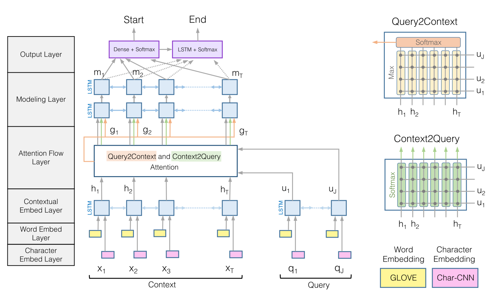

# 简介

## Task Definition
In machine reading comprehension (MRC) tasks, a query (Q) and one or more related paragraphs (Ps) or documents (Ds) will be provided. Machine is requeired to find out the correct answer (A) within the given paragrashs or documents (i.e. P + Q or D => A). Machine reading comprehension is a crucial task in natural-language processing (NLP) and requires deep understanding of languages. 

## DuReader数据集
DuReader is a new large-scale real-world and human sourced MRC dataset in Chinese. DuReader focuses on real-world open-domain question answering. The advantages of DuReader over existing datasets are concluded as follows:

 - Real question
 - Real article
 - Real answer
 - Real application scenario
 - Rich annotation

For more details about DuReader dataset please refer to [DuReader Homepage](https://ai.baidu.com//broad/subordinate?dataset=dureader).

## DuReader基线系统

The DuReader baseline system implements and upgrades a classic reading comprehension model [BiDAF](https://arxiv.org/abs/1611.01603) on the [DuReader dataset](https://ai.baidu.com//broad/subordinate?dataset=dureader) with [PaddlePaddle](http://paddlepaddle.org) framework. The performance of this baseline system on the DuReader 2.0 dataset is shown below

|      Model     | Dev ROUGE-L | Test ROUGE-L |
| :------------- | :---------: | :----------: |
| BiDAF (original DuReader [paper](https://arxiv.org/abs/1711.05073)) |    39.29    |     45.90    |
| This baseline system  |    47.65    |     54.58    |

# 快速开始

## 安装

### 安装PaddlePaddle
To install PaddlePaddle, please refer to [this guide](http://www.paddlepaddle.org/#quick-start). This baseline system has been tested on python 2.7.13 and PaddlePaddle 1.3.1

### 克隆基线系统代码

```
git clone https://github.com/xxx
```

### Download Thirdparty Dependencies
We use Bleu and Rouge as evaluation metrics, the calculation of these metrics relies on the scoring scripts under "https://github.com/tylin/coco-caption", to download them, run:

```
cd utils && bash download_thirdparty.sh
```

## 运行

### Download Dataset and model
To Download the DuReader 2.0 dataset, trained model parameters and vocabularies, please run:

```
cd data && bash download.sh
```

#### Paragraph Extraction
We incorporate a new strategy of paragraph extraction to improve the model performance. The details have been noted in `paddle/UPDATES.md`. Please run the following command to apply the new strategy of paragraph extraction on each document:

```
sh run.sh --para_extraction
```

Note that the full preprocessed dataset should be downloaded before running this command (see the section above). The results of paragraph extraction will be saved in `data/extracted/`. 

#### Evaluate
To evaluate on the DuReader devset with the provided model parameters, please run the following command:

```
sh run.sh --evaluate  --load_dir ../data/saved_model --devset ../data/extracted/devset/zhidao.dev.json ../data/extracted/devset/search.dev.json
```
The ROUGE-L metric will be calculated automatically after the evaluation.


#### Inference (Prediction)
To do inference on the DuReader testset with the provided model parameters, please run: 

```
sh run.sh --predict  --load_dir  ../data/saved_model --testset ../data/extracted/testset/zhidao.test.json ../data/extracted/testset/search.test.json
```
The predicted answers will be saved in the folder `data/results`.


#### Training

Before training the model, you need to prepare the vocabulary for the dataset and create the folders that will be used for storing the models and the results. You can run the following command for the preparation:

```
sh run.sh --prepare --trainset ../data/extracted/trainset/zhidao.train.json ../data/extracted/trainset/search.train.json --devset ../data/extracted/devset/zhidao.dev.json ../data/extracted/devset/search.dev.json --testset ../data/extracted/testset/zhidao.test.json ../data/extracted/testset/search.test.json
```

To start training on the DuReader trainset, please run the following command:

```
sh run.sh --train --pass_num 5 --trainset ../data/extracted/trainset/zhidao.train.json ../data/extracted/trainset/search.train.json --devset ../data/extracted/devset/zhidao.dev.json ../data/extracted/devset/search.dev.json
```
This will start the training process with 5 epochs. The trained model will be evaluated automatically after each epoch, and a folder named by the epoch ID will be created under the folder `data/models`, in which the model parameters are saved. If you need to change the default hyper-parameters, e.g. initial learning rate and hidden size, please run the commands with the specific arguments. 

```
sh run.sh --train --pass_num 5 --learning_rate 0.00001 --hidden_size 100 --trainset ../data/extracted/trainset/zhidao.train.json ../data/extracted/trainset/search.train.json --devset ../data/extracted/devset/zhidao.dev.json ../data/extracted/devset/search.dev.json
```

More arguments can be found in `paddle/args.py`.


#### Submit the test results
Once you train a model that is tuned on the dev set, we highly recommend you submit the predictions on test set to the site of DuReader for evaluation purpose. To get inference file on test set:

1. make sure the training is over.
2. select the best model under `data/models` according to the training log.
3. predict the results on test set.
4. [submit the prediction result file](http://ai.baidu.com/broad/submission?dataset=dureader).


# 进阶使用
## 任务定义与建模
阅读理解任务的输入包括：

 - 一个问题Q (已分词)，例如：["明天"， "的", "天气", "怎么样", "？"]；
 - 一个或多个段落P (已分词)，例如：[["今天", "的", "天气", "是", "多云", "转", "晴", "，", "温度", "适中", "。"],  ["明天", "气温", "较为", "寒冷", "，", "请", "注意", "添加", "衣物", "。"]]。

模型输出包括：

 - 段落P中每个词是答案起始位置的概率以及答案结束位置的概率 (boundary model)，例如：起始概率=[[0.01, 0.02, ...], [0.80, 0.10, ...]]，结束概率=[[0.01, 0.02, ...], [0.01, 0.01, ...]]，其中概率数组的维度和输入分词后的段落维度相同。

模型结构包括：

 - 嵌入层 (embedding layer)：输入采用one-hot方式表示的词，得到词向量；
 - 编码层 (encoding layer)：对词向量进行编码，融入上下文信息；
 - 匹配层 (matching layer)：对问题Q和段落P之间进行匹配；
 - 融合层 (fusion layer)：融合匹配后的结果；
 - 预测层 (output layer)：预测得到起始、结束概率。

## 模型原理介绍
下图显示了原始的[BiDAF](https://arxiv.org/abs/1611.01603)模型结构。在本基线系统中，我们去掉了char级别的embedding，在预测层中使用了[pointer network](https://arxiv.org/abs/1506.03134)，并且参考了[R-NET](https://www.microsoft.com/en-us/research/wp-content/uploads/2017/05/r-net.pdf)中的一些网络结构。
<p align="center">
 <br />
</p>


## 数据格式说明
DuReader数据集中每个样本都包含若干文档(documents)，每个文档又包含若干段落(paragraphs)。有关数据的详细介绍可见[官网](https://ai.baidu.com//broad/subordinate?dataset=dureader)、[论文](https://arxiv.org/abs/1711.05073)以及数据集中包含的说明文件，下面是一个来自训练集的样本示例

```
{
    "documents": [
        {
            "is_selected": true,
            "title": "板兰根冲剂_百度百科",
            "most_related_para": 11,
            "segmented_title": ["板兰根", "冲剂", "_", "百度百科"],
            "segmented_paragraphs": [
                    ["板兰根", "冲剂", "，", "药", "名", ":", ... ],
                    ["【", "功效", "与", "主治", "】", ...],
                    ...
            ],
            "paragraphs": [
                "板兰根冲剂，药名...",
                "【功效与主治】...",
                ...
            ],
            "bs_rank_pos": 0
        },
        {
            "is_selected": true,
            "title": "长期喝板蓝根颗粒有哪些好处和坏处",
            "most_related_para": 0,
            "segmented_title": ["长期", "喝", "板蓝根", "颗粒", "有", "哪些", "好处", "和", "坏处"],
            "segmented_paragraphs": [
                ["板蓝根", "对", "感冒", "、", "流感","、", ...],
                ...
            ],
            "paragraphs": [
                "板蓝根对感冒、流感、流脑、...",
                ...
            ],
            "bs_rank_pos": 1
        },
        ...
    ],
    "answer_spans": [[5, 28]],
    "fake_answers": ["清热解毒、凉血;用于温热发热、发斑、风热感冒、咽喉肿烂、流行性乙型脑炎、肝炎、腮腺炎。"],
    "question": "板蓝根颗粒的功效与作用",
    "segmented_answers": [
        ["清热解毒", "、", "凉血", "；", "用于", "温", "热", "发热", ...],
        ["板蓝根", "的", "用途", "不仅", "是", "治疗", "感冒", ...],
        ...
    ],
    "answers": [
        "清热解毒、凉血；用于温热发热、发斑、风热感冒、咽喉肿烂、流行性乙型脑炎、肝炎、 腮腺炎 。",
        "板蓝根的用途不仅是治疗感冒，板蓝根的功效与作用多，对多种细菌性、病毒性疾病都有较好的预防与治疗作用。",
        ...
    ],
    "answer_docs": [0],
    "segmented_question": ["板蓝根颗粒", "的", "功效", "与", "作用"],
    "question_type": "DESCRIPTION",
    "question_id": 91161,
    "fact_or_opinion": "FACT",
    "match_scores": [
        0.9583333333333334
    ]
}
```


## 目录结构

```text
.
├── data                 # 包含数据、词表、模型 (需下载)
├── README.md            # 本文档
├── src                  # 源码
└── utils                # 包含评测脚本 (需下载)
```

## 如何组建自己的模型
开发者可以通过修改src/rc_model.py中的网络结构来组建自己的模型。

# 其他

### Copyright and License
Copyright 2017 Baidu.com, Inc. All Rights Reserved

Licensed under the Apache License, Version 2.0 (the "License");
you may not use this file except in compliance with the License.
You may obtain a copy of the License at

    http://www.apache.org/licenses/LICENSE-2.0

Unless required by applicable law or agreed to in writing, software
distributed under the License is distributed on an "AS IS" BASIS,
WITHOUT WARRANTIES OR CONDITIONS OF ANY KIND, either express or implied.
See the License for the specific language governing permissions and
limitations under the License.

### 如何贡献代码

我们欢迎开发者向DuReader基线系统贡献代码。如果您开发了新功能，发现了bug……欢迎提交Pull request与issue到Github。